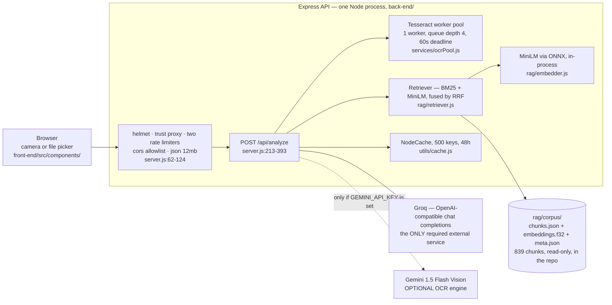
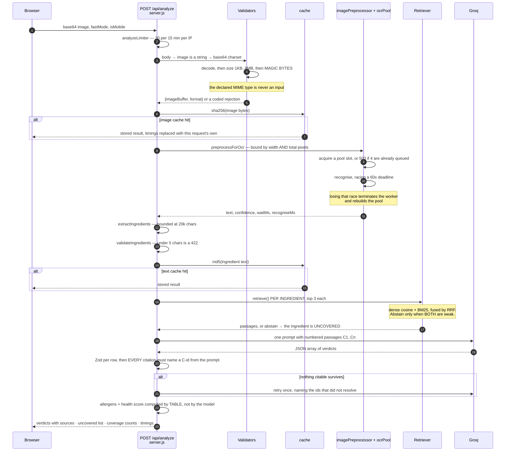
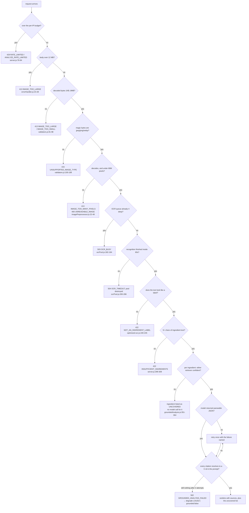
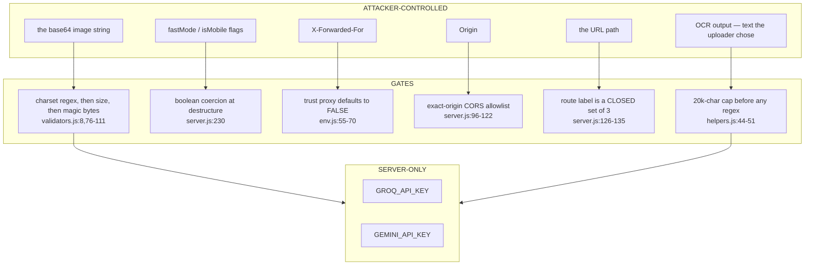
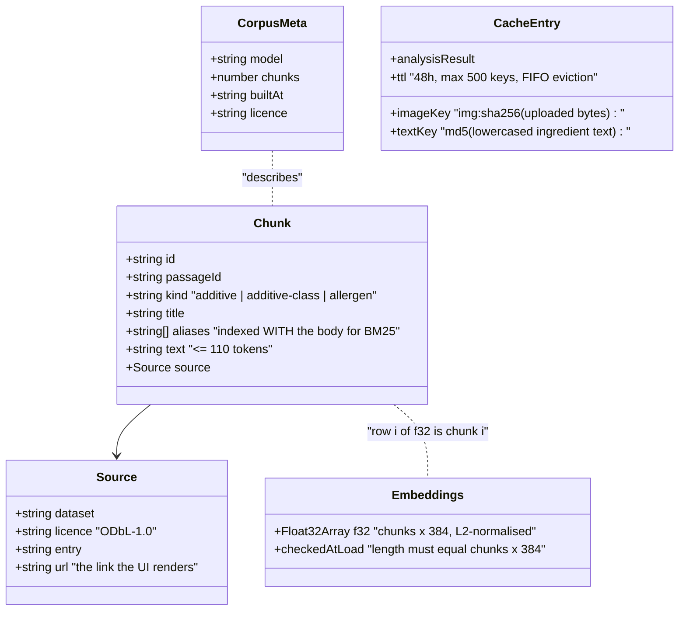
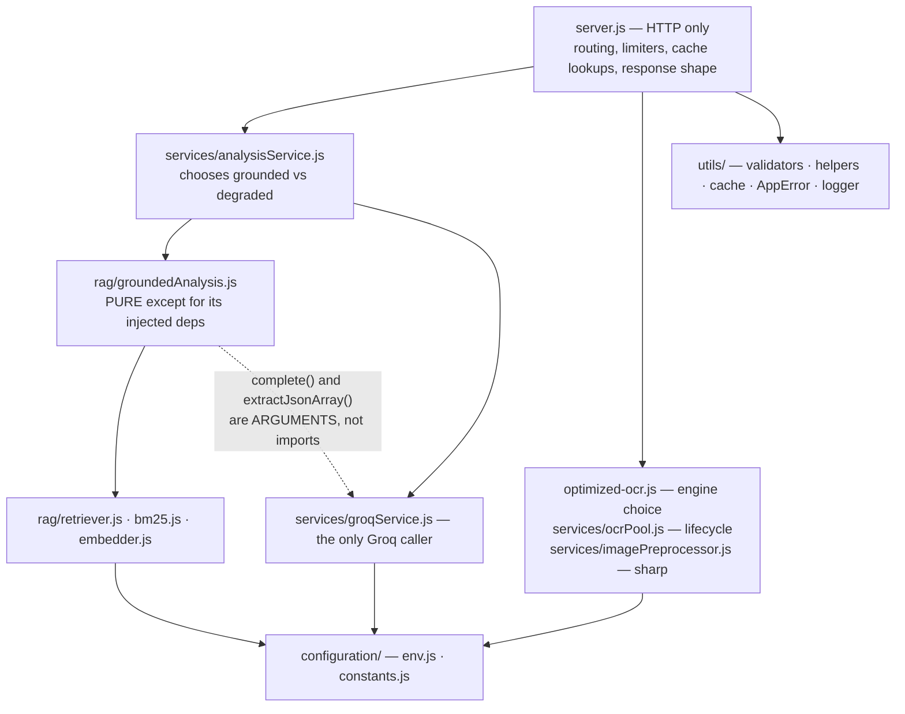
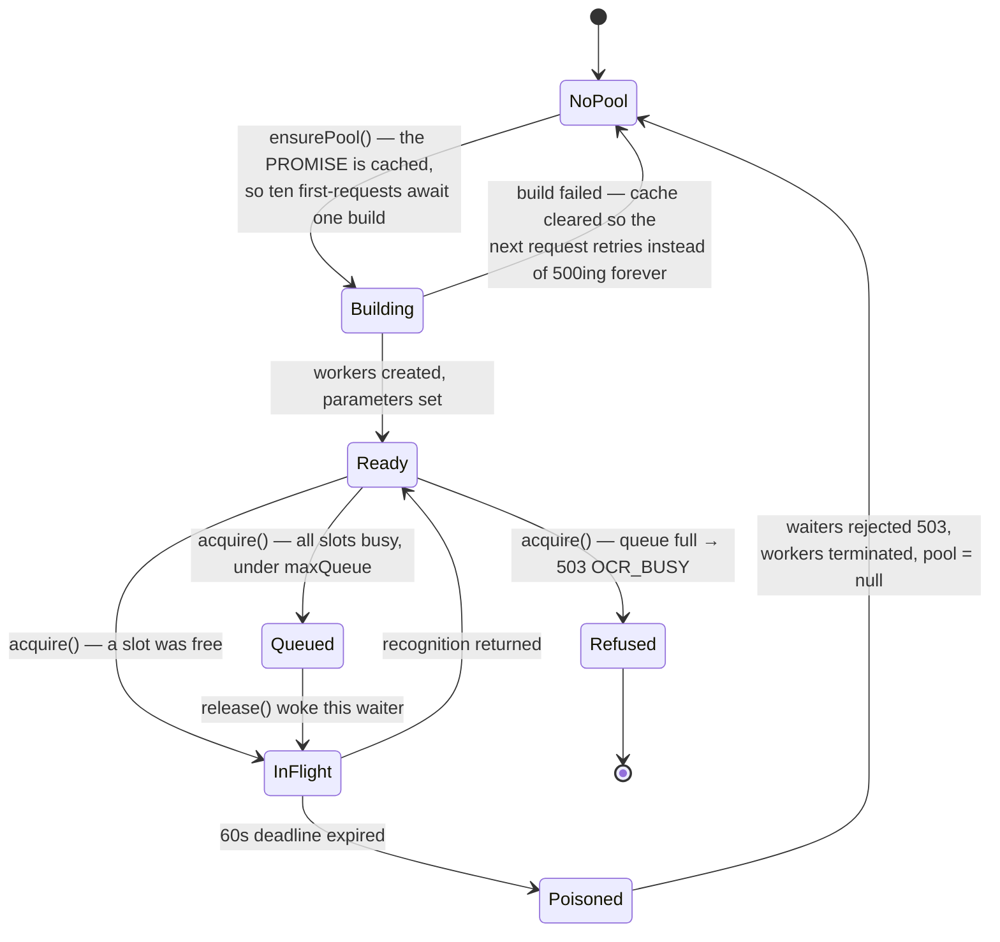

# Architecture

One endpoint does the work: `POST /api/analyze` takes a photograph of a food
label and returns per-ingredient verdicts, each citing a passage from a corpus
built out of the Open Food Facts taxonomies.

The structure worth understanding is not the layering — it is the **ladder of
refusals**. This is a food-safety tool with no account system, no database and
an unauthenticated public endpoint, so at almost every stage the interesting
question is not "how does it compute the answer" but "what does it do when it
cannot". Section 3 is that ladder; the rest of the document supports it.

Every statement here cites the file and line it came from. For *why* a choice
was made, and what the measurement said, see [DECISIONS.md](./DECISIONS.md) and
[MEASUREMENTS.md](./MEASUREMENTS.md) — this file does not repeat either.

---

## 1. The shape of the system



Two external services, one of them optional, and no datastore of any kind. The
corpus is a file in the repository (`back-end/rag/corpus/meta.json`: 839 chunks
over 727 passages, built 2026-08-20). The embedding model runs in this process
through ONNX Runtime — no key, no per-call cost, and the query never leaves the
machine (`back-end/rag/embedder.js:1-9`). There is no vector database, because
at 839 × 384 a brute-force scan is ~322k multiply-adds and measures under a
millisecond (`back-end/rag/retriever.js:9-13`).

**Everything except the verdicts works with no key at all.** OCR, the corpus,
hybrid retrieval, abstention, citation checking, the allergen table and the
health score all run without `GROQ_API_KEY`; the key is checked at the one place
it is used, not at boot (`back-end/configuration/env.js:100-132`,
`back-end/services/groqService.js:197-210`).

---

## 2. One request, end to end



Stage map:

| Stage | File |
| --- | --- |
| admission + validation span | `back-end/server.js:221-250` |
| the validators themselves | `back-end/utils/validators.js:11-123` |
| magic-byte sniff | `back-end/utils/validators.js:52-74`, table at `back-end/configuration/constants.js:61-68` |
| image cache | `back-end/server.js:270-288`, `back-end/utils/cache.js:44-51` |
| preprocess | `back-end/services/imagePreprocessor.js:67-84` |
| OCR engine choice + fallback | `back-end/optimized-ocr.js:268-325` |
| pooled recognition | `back-end/services/ocrPool.js:234-255` |
| ingredient isolation and splitting | `back-end/utils/helpers.js:39-140`, `:141-200` |
| retrieval per ingredient | `back-end/rag/groundedAnalysis.js:346-369` |
| grounded generation + citation check | `back-end/rag/groundedAnalysis.js:414-487` |
| deterministic allergens + score | `back-end/server.js:344-350` |
| degraded fallback | `back-end/services/analysisService.js:63-97` |

Two orderings carry weight:

- **Format is settled from bytes, and only then is the image decoded.**
  `validateImageBuffer` checks size and then `sniffImageType`
  (`back-end/utils/validators.js:76-111`); the declared MIME type in the data
  URL is attacker-controlled and is never read
  (`back-end/utils/validators.js:52-58`).
- **Retrieval happens before generation, per ingredient, and an ingredient whose
  retrieval abstains never reaches the model at all**
  (`back-end/rag/groundedAnalysis.js:337-369`). The model is not asked to decide
  whether it knows something.

---

## 3. The refusal ladder

Every stage can stop the request, and each stop has a distinct code and status
so a caller can tell them apart. This is the section that describes what the
system actually is.



The two rungs that make this a grounded system rather than a wrapper around a
prompt:

**Abstention requires *both* retrievers to be weak.**
`abstain = topCosine < 0.42 && topLexical < 8.5`
(`back-end/rag/retriever.js:152-157`). Abstaining on the dense score alone was
wrong in a way the eval set makes obvious — "INS 211" has a cosine of 0.23
because the embedding model sees every additive code as the same shape of
string, while BM25 puts the correct passage first
(`back-end/rag/retriever.js:45-55`). Both thresholds are measured, not chosen;
DECISIONS.md, "The abstention threshold, and why it is not the best one".

**A citation that names an id which was not in the prompt invalidates the
verdict resting on it.** `validateCitations`
(`back-end/rag/groundedAnalysis.js:247-273`) rejects a verdict with no citations
at all, and a verdict citing `C7` when only six passages were supplied. The
comment states the reasoning: the model has invented the evidence, so the
verdict cannot be trusted even if it happens to be correct.

**Degrading is loud, and only for two named reasons.** `DEGRADABLE_CODES` is an
allow-list of exactly `GROUNDED_ANALYSIS_FAILED` and `CORPUS_UNAVAILABLE`
(`back-end/services/analysisService.js:20-28`); anything else propagates rather
than quietly switching the app to unsourced verdicts. When it does degrade the
response carries `grounded: false` and a `degradedReason` sentence
(`back-end/services/analysisService.js:74-96`), and every verdict has its
`citations` and `sources` explicitly emptied
(`back-end/services/analysisService.js:78`) rather than left looking sourced.

**And two things are never asked of the model at all.** Allergen flags come from
a keyword table matched on word boundaries, and the health score is arithmetic
over the verdicts (`back-end/server.js:344-350`,
`back-end/configuration/constants.js:21-38`). A user with a peanut allergy needs
the same answer every time for the same label; a generative model gives no such
guarantee.

---

## 4. Trust boundaries and privilege

There is one privilege tier. The API is unauthenticated on purpose, there are no
sessions, no cookies and no user data, so the boundary that matters is
**untrusted bytes entering a process that spends CPU and money on them**.



Four of those gates exist because the obvious version of them failed:

- **`trust proxy` defaults to `false`, not `1`.** `trust proxy: 1` does not mean
  "trust one real proxy"; it means take an entry from `X-Forwarded-For` as
  `req.ip` whether or not a proxy set it. This repo's own shipped topology has no
  proxy in front of it — `docker-compose.yml` publishes `5000:5000` and the nginx
  config has no `proxy_pass` — so a client rotating that header used to get a
  fresh bucket per request. Measured, 300 requests against a 20-per-15-minute
  budget: `trust proxy 1` with a rotating header allowed all 300
  (`back-end/configuration/env.js:31-54`).
- **CORS lists exact origins.** The production list used to end with
  `/\.vercel\.app$/`, which matches any site anybody deploys to Vercel. The API
  is unauthenticated so CORS is not protecting data — but that regex let an
  attacker's page drive its visitors' browsers into `/api/analyze`, spending this
  project's Groq quota from residential addresses the rate limiter sees as
  unrelated users (`back-end/server.js:96-105`).
- **The metric route label is a closed set.** `req.path` on a 404 is whatever
  anyone typed; one scan of this unauthenticated API would mint a time series per
  probed URL until the process ran out of memory
  (`back-end/server.js:126-135`).
- **`isProductionEnv` is a deny-list, and reads the raw variable.** Anything that
  has not explicitly named itself `development` or `test` is treated as
  production and gets no internal error detail. The old test was
  `NODE_ENV !== "production"`, so `"prod"`, `"staging"`, a typo or the empty
  string a container gets when the variable is dropped all took the development
  branch and attached internals to the response
  (`back-end/configuration/env.js:72-93`, applied at
  `back-end/middleware/errorHandler.js:59-66`).

**Keys never reach the browser.** Both provider calls are made from the server
(`back-end/services/groqService.js:216-229`,
`back-end/optimized-ocr.js:145-167`); the frontend is a static bundle whose only
build-time variable is `VITE_API_URL`.

One thing worth naming plainly: **OCR output is untrusted text that is then
interpolated into a model prompt.** `buildPrompt`
(`back-end/rag/groundedAnalysis.js:286-305`) substitutes ingredient names that
came from a photograph the caller supplied. What limits that is not escaping —
there is none — but scope: the names are the output of
`parseIngredientList`, each is a short fragment split on top-level punctuation
(`back-end/utils/helpers.js:141-200`), at most 25 of them
(`back-end/rag/groundedAnalysis.js:332`), and every verdict that comes back must
still resolve to a passage id from the prompt. A prompt injection that produced
an uncitable verdict would be dropped by `validateCitations`; one that produced a
*citable* verdict is bounded by what the corpus actually says.

---

## 5. What the data is, when there is no database

Nothing here is persisted between restarts. There are three data shapes and they
are all either read-only files or in-process memory.



The parts that are not obvious:

**`aliases` are indexed with the chunk body, not stored beside it.** The BM25
document for a chunk is `title + aliases + text`
(`back-end/rag/retriever.js:62-69`), which is what makes "E211" and "sodium
benzoate" hit the same passage. This is the mechanism behind the whole reason for
having a lexical retriever at all: additive codes are exactly the strings that
appear on a real label and exactly the strings a dense embedding cannot tell
apart.

**The embeddings are a flat `Float32Array`, and the parity check is at load.**
`chunks.length * 384` floats or the load throws with an instruction to re-run
`rag/ingest.js` (`back-end/rag/retriever.js:84-89`). There is no per-chunk vector
object and no id lookup during the scan — chunk *i* is at offset *i × 384*
(`back-end/rag/retriever.js:98-105`).

**`meta.json` exists so `/health` does not have to load the corpus.**
`readCorpusMeta` reads a few hundred bytes; `getRetriever` reads ~1.3MB and
builds the BM25 index. A health check that wanted three fields for its response
body was doing the whole load, on the cold container, on the platform's probe,
before any user had asked for anything (`back-end/rag/retriever.js:193-204`,
used at `back-end/server.js:182-211`).

**The cache is content-addressed twice, and bounded because the caller chooses
the content.** `maxKeys: 500` is not tidiness: appending one byte after a JPEG's
EOI marker changes the sha256 without changing a pixel, so an unbounded cache is
an unbounded allocation with a 48-hour TTL holding every entry
(`back-end/configuration/constants.js:41-65`). And because node-cache enforces
`maxKeys` by *throwing* `ECACHEFULL` rather than evicting, `CacheManager.set`
catches it and drops the oldest key — without that, the bound would trade a
memory leak for an outage (`back-end/utils/cache.js:33-65`).

---

## 6. Module boundaries



| Module | Owns | Does not touch |
| --- | --- | --- |
| `server.js` | the HTTP contract: status codes, the response body, cache lookups, timing marks | how OCR works, how retrieval works, how a verdict is validated |
| `services/analysisService.js` | one decision — grounded, or loudly degraded | HTTP, prompts, retrieval internals |
| `rag/groundedAnalysis.js` | the grounded protocol: retrieve, number, prompt, validate citations, retry once | the model client and the JSON extractor, both **injected** (`groundedAnalysis.js:321-331`) |
| `rag/retriever.js` | fusion, thresholds, the corpus | prompts, HTTP |
| `services/groqService.js` | every HTTP call to the provider, and salvaging JSON out of its replies | retrieval, citations |
| `services/ocrPool.js` | worker lifecycle, admission control, the deadline | image content |
| `configuration/constants.js` | every tunable number, each with the measurement that chose it | logic |

**What is genuinely enforced, versus what is convention:**

1. **`groundedAnalysis.js` cannot reach the network**, because it has no import
   that can. `complete` and `extractJsonArray` are parameters
   (`back-end/rag/groundedAnalysis.js:321-331`), which is why
   `back-end/tests/rag-grounded.test.js` drives the entire grounded path — retry
   included — with no API key. That is a real boundary: adding a `fetch` there
   would break the tests immediately.
2. **The evaluation harness imports the *application's* prompt builders**, not
   copies of them (`back-end/rag/eval/run-eval.js:16`,
   `back-end/rag/eval/run-generation-eval.js:45`). `buildRetryPrompt` is exported
   for exactly this reason, stated at `back-end/rag/groundedAnalysis.js:307-311`:
   a harness that re-words the retry is measuring a prompt this application never
   sends.
3. **`telemetry.js` deliberately does not import the OCR pool.** The queue-depth
   gauge is registered from `server.js` instead, so that module does not pull
   Tesseract into every process that only wanted a tracer
   (`back-end/server.js:51-55`).
4. **Errors become responses in exactly one place**
   (`back-end/middleware/errorHandler.js:13-77`), and the mapping order is
   load-bearing: typed `AppError` first, then framework properties, and only then
   message-text matching. Text-first was the previous version, and an oversized
   upload — whose message body-parser writes as "request entity too large" — fell
   through to a generic 500 (`back-end/middleware/errorHandler.js:1-8`).

Not enforced: nothing stops a new module importing `groqService` directly, and
`optimized-ocr.js` reads `process.env.GEMINI_API_KEY` itself
(`back-end/optimized-ocr.js:133,269`) rather than going through
`configuration/env.js`, which is the one place the config indirection is
bypassed.

---

## 7. Concurrency and resource control

There is no shared state to race over — no database, no cross-request mutation
except the cache. The concurrency in this system is entirely about **admitting
work**, and it lives in one file.

**The pool is a semaphore in front of a scheduler, and the two are deliberately
separate** (`back-end/services/ocrPool.js:10-18`). tesseract.js's own scheduler
decides *which* worker runs a job; its queue is unbounded, and an unbounded queue
on a one-core container does not fail — it stops answering, which is worse. The
semaphore decides *how many* jobs may be in flight and how many may wait
(`back-end/services/ocrPool.js:175-218`).



Three details are the whole design:

- **The build is idempotent by caching the promise, not the value**
  (`back-end/services/ocrPool.js:120-126`), so concurrent first requests await
  one build rather than starting several pools. A *failed* build clears the cache
  (`:167-170`), or the process would serve 500s forever instead of retrying.
- **A timed-out job cannot be cancelled** — tesseract.js exposes no abort — so
  the worker is terminated and the pool rebuilt
  (`back-end/services/ocrPool.js:106-110`, `:288-317`). Rejecting the caller
  while leaving the worker chewing would free the semaphore slot and not the CPU,
  which is the same denial with better bookkeeping.
- **Queued callers are rejected on poisoning rather than migrated**
  (`back-end/services/ocrPool.js:288-297`): they were queued behind a job that
  has just been abandoned, and silently re-queueing them onto a pool still being
  rebuilt is how a queue turns into a hang.

The deadline is 60 s and the number is measured, not chosen. The pixel cap bounds
the work to within a factor of about two, not exactly: at an identical 4.0M
pixels, `npm run bench:bounds` measured 12989 ms for 2000×2000 against 27628 ms
for 1265×3162 — a 2.1× spread, not monotonic in aspect ratio. 30 s left a 1.09×
margin over the worst legitimate image the cap admits and would have fired on
real uploads (`back-end/services/ocrPool.js:70-111`).

**Two bounds on caller-chosen work, because either alone is bypassable.**
`maxWidth` bounds one dimension and one dimension is not the work: a 2000×20000
upload — 5.46 MB, comfortably under the 8 MB cap — received no downscale at all
and cost 126.2 s against 11.4 s for a normal label. `boundedWidth` caps total
area (`back-end/services/imagePreprocessor.js:67-84`,
`back-end/configuration/constants.js:113-130`), and `limitInputPixels` is stated
rather than inherited from sharp's default so a version bump cannot change the
guarantee silently (`back-end/configuration/constants.js:131-145`).

**Pool size is 1, and that is a measurement.** On one core, p50 at concurrency 1
was 2214 ms with one worker, 4021 ms with two and 8701 ms with three — more
workers is not slightly worse, it is much worse, and worse even at concurrency 1
(`back-end/services/ocrPool.js:39-61`).

Everything else that looks like shared state is a module-scoped singleton with a
lazy initialiser: the retriever (`back-end/rag/retriever.js:180-186`), the
embedding pipeline (`back-end/rag/embedder.js:21-41`), the cache
(`back-end/utils/cache.js:100`). All are read-mostly and none is written from a
request.

---

## 8. When a dependency is down

| Event | What happens | Where |
| --- | --- | --- |
| **`GROQ_API_KEY` missing** | The process **starts** and warns once, naming the variable and the free-key URL. `/health` reports `generation: "disabled"`. OCR, retrieval and abstention all still run; only the verdict call fails, with a 503 that says which half ran. It used to exit at boot, which made `/health` — the first thing the README says to curl — unreachable without a Groq account. | `back-end/configuration/env.js:100-132`, `back-end/services/groqService.js:197-210`, `back-end/server.js:204-206` |
| **Groq times out** | 504 `ANALYSIS_TIMEOUT` at 20 s (`AbortSignal.timeout`). | `back-end/services/groqService.js:230-236`, `back-end/configuration/constants.js:93-97` |
| **Groq unreachable** | 503 `ANALYSIS_UNREACHABLE`. | `back-end/services/groqService.js:237-242` |
| **Groq answers 429** | Passed through as 429 `ANALYSIS_RATE_LIMITED` — a provider rate limit is not our bug, and saying so plainly is the difference between "wait" and "file an issue". | `back-end/services/groqService.js:244-261` |
| **Groq returns unparseable or uncitable output** | One retry, worded with the specific failure; then 502 `GROUNDED_ANALYSIS_FAILED`, which is the one code that triggers the loud degrade. | `back-end/rag/groundedAnalysis.js:414-446`, `:490-494` |
| **Groq returns a truncated array** | Whole `{...}` objects are salvaged and the incomplete tail dropped — eleven good verdicts beat an error page. | `back-end/services/groqService.js:72-108` |
| **Corpus files missing or inconsistent** | Load throws naming the fix (`re-run rag/ingest.js`); `analysisService` matches that on both the code and a message regex and degrades loudly. | `back-end/rag/retriever.js:84-89`, `back-end/services/analysisService.js:63-66` |
| **Gemini configured but failing** | Falls back to Tesseract, **except** for a 422 `NOT_AN_INGREDIENT_LABEL`, which is re-thrown: both engines read the same photo, so re-reading one Gemini just confirmed is not a label only burns 20 more seconds. | `back-end/optimized-ocr.js:261-292` |
| **Gemini hangs** | 15 s `AbortSignal.timeout` → 504, then the Tesseract fallback. | `back-end/configuration/constants.js:109-111`, `back-end/optimized-ocr.js:163-180` |
| **Tesseract worker errors on an undecodable image** | An `errorHandler` is supplied to `createWorker` — **not optional**: without one tesseract.js re-throws inside its own message handler where nothing can catch it, so one bad image takes the process down. | `back-end/services/ocrPool.js:140-146` |
| **Warm-up fails at boot** | Logged, not fatal. Every warmed path also initialises lazily, so a failed warm-up costs latency, not availability — and `/health` answers throughout, because a probe that times out during warm-up restarts the container it is waiting for. | `back-end/server.js:448-480`, `:177-181` |
| **Cache is full** | Oldest key evicted, request proceeds. | `back-end/utils/cache.js:56-65` |
| **SIGTERM / SIGINT** | Terminate the OCR child processes, flush telemetry, close the cache, exit — with a 5 s deadline, because a shutdown that hangs on a stuck worker is not a shutdown. Without this the workers outlive the signal and the container has to be killed rather than stopped. | `back-end/server.js:411-446` |
| **Unhandled rejection** | Logged. Node 20+ would otherwise terminate with no explanation. | `back-end/server.js:405-409` |

---

## 9. What this architecture does not do

- **It serves about one user at a time, and that is structural.** One Tesseract
  worker on one core, queue depth four, and a 60-second per-job ceiling. Measured
  throughput is flat near 0.45 req/s regardless of concurrency
  (`back-end/services/ocrPool.js:39-61`). Scaling this means more processes, and
  the next two bullets are why that is not free.
- **All state is in-process.** The result cache, the OCR pool, the retriever and
  the embedding session are each per-process singletons. N instances mean N
  copies of a ~90MB model plus a 1.3MB corpus, N unrelated caches, and — because
  `express-rate-limit` uses its default memory store
  (`back-end/server.js:76-94`) — N times the rate-limit budget.
- **Nothing is persisted.** No database, no object store, no audit log of what
  was analysed. A restart loses the cache and nothing else, because there is
  nothing else.
- **The corpus is a build artifact committed to the repository**, refreshed by
  running `npm run ingest` by hand. There is no scheduled re-ingest, so the
  taxonomy drifts from Open Food Facts until someone re-runs it
  (`back-end/rag/corpus/meta.json` records `builtAt`).
- **Retrieval is a linear scan.** Fine at 839 chunks; the file says plainly it
  stops being the right answer somewhere in the low hundreds of thousands
  (`back-end/rag/retriever.js:9-13`).
- **There is no authentication, no per-user quota and no billing attribution.**
  The per-IP limiter is the only thing standing between a visitor and the Groq
  budget, which is exactly why `trust proxy` and the CORS list are treated as
  security controls in §4 rather than as configuration.
- **The corpus covers additives and allergens, not foods.** A label of whole
  ingredients returns mostly `uncovered`. That is the system working, and it
  looks empty.
- **The allergen check is a keyword match**, matched on word boundaries against a
  fixed table (`back-end/configuration/constants.js:21-38`). It cannot see "may
  contain traces" warnings outside the ingredients section, and it will miss an
  allergen named in a way the list does not cover.
- **English only** — one `eng.traineddata` is bundled.
- **The frontend has no tests**, and the Docker setup has not been executed in
  the environment where it was written.

---

## 10. Defects found while writing this document — and fixed

All three were reproduced before being fixed, and each carries a test that
fails against the code as it stood when this section was first written.

### 10.1 The context budget silently converted covered ingredients into "uncovered" — FIXED

`back-end/rag/groundedAnalysis.js` set three limits:

```js
export const MAX_INGREDIENTS = 25;
export const CHUNKS_PER_INGREDIENT = 3;
export const MAX_CONTEXT_CHUNKS = 24;
```

The retrieval loop appended each ingredient's passages to a shared `chunkOrder`
and stopped adding once the cap was reached:

```js
if (seenChunks.has(chunk.id) || chunkOrder.length >= MAX_CONTEXT_CHUNKS) continue;
```

but the ingredient itself was pushed onto `grounded` **before** that loop ran,
and `buildPrompt(block, grounded)` listed every one of them. So once 24 distinct
chunks had accumulated — as few as **eight ingredients** when their passages do
not overlap — every later ingredient was named in the prompt with none of its
evidence in the context block.

The model is instructed to "omit that ingredient entirely rather than guessing",
which is exactly what it should do. Those ingredients therefore fell through to
the sweep and were reported as:

> "Retrieved passages did not support a verdict for this ingredient."

That sentence was false for this class of ingredient. The passages *did* support
a verdict — they were retrieved, they cleared both abstention thresholds, and
they were then dropped by a budget the message said nothing about. A reader
could not distinguish "the corpus has nothing on this" from "we ran out of
prompt", and those call for completely different actions. No unsupported verdict
was ever produced, so this was a truthfulness bug in the `uncovered` reason and
in `coverage.uncovered` rather than a fabrication — but the whole point of this
subsystem is that the gap it reports is trustworthy, so a reason string that
misattributes the gap is the wrong kind of wrong for this codebase in
particular.

**Reproduced:** ten ingredients with three passages each, against the
24-passage budget, put 24 passages and all ten ingredient names in the prompt,
returned eight verdicts, and reported ingredients 9 and 10 as unsupported by
their own evidence.

**Fixed** by choosing the passages before naming the ingredients:

| piece | what it does | where |
| --- | --- | --- |
| `selectContextChunks` | spends the budget one round at a time — every ingredient gets its top passage before any gets its second | `back-end/rag/groundedAnalysis.js:137-163` |
| `contextBudgetFor` | never returns a budget below one passage per ingredient; `MAX_INGREDIENTS` caps that at 25, one passage over target rather than an unbounded prompt | `back-end/rag/groundedAnalysis.js:112-114` |
| prompt construction | names only the ingredients whose passages survived selection, so the prompt can only ask about evidence it is carrying | `back-end/rag/groundedAnalysis.js:371-411` |

The same ten-ingredient label now returns ten verdicts inside the same
24-passage budget. Batching into several model calls was the alternative — it
would give 25 ingredients 25 ingredients' worth of evidence — and was rejected
because it multiplies latency and provider cost against a 20-second mobile
timeout to buy supporting passages, not coverage: round-robin already
guarantees every ingredient its best passage.

An ingredient can now carry no verdict for three reasons and they no longer
share a sentence (`back-end/rag/groundedAnalysis.js:54-56`):

| code | meaning |
| --- | --- |
| `NO_SOURCE` | retrieval found nothing above threshold. The honest gap. |
| `MODEL_DECLINED` | passages were put in front of the model and it would not rule. |
| `BUDGET_DROPPED` | passages were retrieved and then dropped to fit the prompt. Nothing was asked about this ingredient at all. |

`BUDGET_DROPPED` is unreachable in the shipped configuration — the budget floor
above sees to that — and exists so that a future budget change surfaces under
its own name instead of as a lie about retrieval. `AnalysisResult.jsx` renders
the three under three headings.

### 10.2 A verdict the model renamed was counted as uncovered *and* returned — FIXED

Immediately below, the sweep decided which ingredients went unanswered by exact
string match:

```js
const answered = new Set(valid.map((v) => v.ingredient.toLowerCase()));
for (const name of grounded) {
  if (!answered.has(name.toLowerCase())) { uncovered.push({ ingredient: name, ... }); }
}
```

Nothing constrains the model to echo the ingredient string it was given. A
reply of `"sodium benzoate"` for an input of `"Sodium Benzoate (E211)"`
validates, cites correctly, and was returned in `analysis` — while the original
name was *also* pushed to `uncovered`, because the lowercased strings differ.
The response then contained the same ingredient in both lists and
`coverage.analysed + coverage.uncovered` exceeded `coverage.parsed`.

**Fixed** by attributing every verdict back to the label's own wording before
anything is counted (`matchVerdictsToNames`,
`back-end/rag/groundedAnalysis.js:215-244`). The comparison runs over a small
explicit alias set — the name, the name without its parenthetical, and the
parenthetical itself (`ingredientKeys`, `:183-196`) — and deliberately does no
fuzzy or substring matching, because `"sugar"` capturing `"sugar syrup"` would
attribute a verdict to an ingredient nobody ruled on: the same class of error as
§10.1. A verdict naming nothing that was asked about, or a second verdict for an
ingredient already answered, is counted in `droppedRows` rather than in
coverage.

Numbering the ingredients `I1..In` in the prompt the way the passages are
numbered — the fix this section originally proposed — was reconsidered and not
taken. It makes attribution exact only when the model emits the token correctly,
and converts a rename, today a recoverable mismatch, into a lost verdict and a
retry. Attribution is done on our side instead, where it is deterministic and
testable without a provider.

`analyzeGrounded` now returns `considered`, and
`verdicts.length + uncovered.length === considered.length` holds by construction
on the grounded path; `coverage.reconciled` says so in the payload
(`back-end/server.js:358-368`). The degraded path answers from a prompt built on
raw label text rather than on this list, so it reports no reconciliation rather
than an arithmetic that does not hold.

### 10.3 A transient degradation was cached for 48 hours — FIXED

`back-end/server.js` stored the result under both keys unconditionally:

```js
cacheManager.set(textKey, result);
cacheManager.set(imageKey, result);
```

`result` carries `grounded` and `degradedReason`, so an analysis that fell back
to the ungrounded path — because Groq happened to return something uncitable
twice, or the corpus had not finished loading — was memoised with
`grounded: false` for the cache TTL of 48 hours. Every later request for the
same photo, or for any photo yielding the same ingredient text, was served the
unsourced answer from cache long after the condition that caused it had
cleared. There was no invalidation path and no admin endpoint; only a restart
cleared it. The third write, promoting a text-key hit onto the image key, had
the same effect one level down.

The degradation is loud in the payload, which is the property DECISIONS.md
promises and it holds — but "loud" was meant to describe a moment, not a two-day
state.

**Fixed** by giving a degraded result the TTL its honesty earns:
`CacheManager.setResult` (`back-end/utils/cache.js:75-77`) applies
`ttlForResult` (`:22-24`), which returns `CACHE_CONFIG.degradedTTL` — 60
seconds, overridable with `DEGRADED_CACHE_TTL`
(`back-end/configuration/constants.js:44-58`) — for anything carrying
`grounded: false`. Not caching it at all would also be correct and would re-run
OCR, the expensive half of the pipeline, for every retry during an outage; a
short TTL keeps that protection and caps the staleness at a minute. The policy
lives in `setResult` rather than at the call sites because there are three of
them and any one writing through `set()` restores the whole class.

**Reproduced** with a stub answering every prompt with schema-valid verdicts
that cite nothing (`scripts/stub-llm.js`, `citations: false`): the grounded path
rejects them twice and raises `GROUNDED_ANALYSIS_FAILED`, the ungrounded path
accepts them, and the route returns 200 with `grounded: false`. Against the
pre-fix server the same photo was still being served from cache afterwards with
no expiry in sight.
