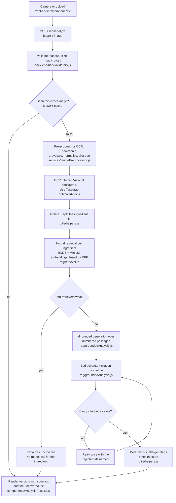

# Smart Ingredient Analyzer

Photograph a food label. The app reads it with OCR, retrieves what the Open
Food Facts taxonomies say about each ingredient, and returns a verdict per
ingredient **that cites the passage it came from** — or reports that no
authoritative source covers that ingredient, rather than inventing one.

## Reproduce the numbers in six seconds

```bash
cd back-end && npm ci && npm run eval
```

Six seconds. No API key, no network, no account, no Docker. It scores retrieval
over 58 hand-labelled questions against a corpus committed to this repository,
and prints the ablation below, the abstention precision and recall, and — by
name — the five questions it gets wrong. **Every number in this README is that
command's output.**

| mode | recall@1 | recall@3 | recall@5 |
| --- | --- | --- | --- |
| dense only | 48% | 73% | 78% |
| lexical only (BM25) | 83% | 95% | 95% |
| hybrid (configured) | 83% | 95% | 95% |

**Hybrid does not beat lexical on this corpus** — the most useful line in that
table, and not what the design was hoping for. The reading, the three questions
where dense retrieval still earns its keep, and the one where the fusion throws
that win away, are under [Measured results](#measured-results).

`cd back-end && npm test` runs 86 unit tests on the same terms: no key, no
network, about 35 seconds.

## Pipeline



### Corpus

839 chunks from 727 passages, built from three Open Food Facts taxonomies:
additives (E numbers, additive class, EFSA evaluation notes), additive classes
(what a preservative or an emulsifier does), and the allergen list. It is
committed, so the app and the evaluation both run with no network call and no
account. `npm run ingest` rebuilds it.

The corpus covers **regulated additives and allergens**. It does not cover
whole foods — there is no passage about water, sugar or tamarind, which is why
those come back as uncovered. See
[`back-end/rag/CORPUS.md`](./back-end/rag/CORPUS.md) for the sources and the
ODbL obligations.

### Chunking

Chunks are capped at **110 tokens**. The embedding model,
`Xenova/all-MiniLM-L6-v2`, accepts 256 tokens and silently truncates past that,
and its quality degrades well before the cap. 110 sits inside the usable range
with headroom for the tokenizer's special tokens. Chunks overlap by one
sentence so a fact on a boundary is retrievable from either side. A sentence
longer than the budget is hard-split rather than left to be truncated
invisibly. `back-end/rag/chunker.js`

### Retrieval

Two retrievers, fused with weighted Reciprocal Rank Fusion:

- **BM25** over the passage text plus its aliases. Ingredient identifiers are
  exact strings — a label says `INS211`, `E211` or `E 211`, all normalised to
  one token — and a lexical index ranks the one passage containing them first.
- **Dense** cosine over MiniLM embeddings. Wins when the query shares no words
  with the passage.

No vector database. The argument is a size argument, not a stopwatch one: at
839 chunks × 384 dimensions a query is about **322k multiply-adds**, which is
smaller than the JSON parsing around it and orders of magnitude below the model
call it feeds. A vector index would add an operational dependency and a network
hop to save something that is already too small to find.

`npm run eval` prints p50/p95/max for whatever machine it runs on, and prints
the machine with them. Those figures are deliberately not quoted here: they are
wall clock over 40 warm queries and they move by 3× between a laptop and a
loaded CI box, so any fixed number in this file would be precision the method
cannot support. The multiply-add count does not move.

It is a linear scan, so this stops being the right answer somewhere in the low
hundreds of thousands of chunks. `back-end/rag/retriever.js`

## What it looks like


> Both screenshots — and the deployment that used to be linked here — show the
> **pre-retrieval** build: bare Good/Bad/Neutral verdicts, no citations, no
> `uncovered` list, and a "Powered by Gemini AI" badge the code no longer earns.
> They are the version this README argues against. Run it locally instead:
> [Setup](#setup) takes about two minutes and needs no account of any kind.
> The full detail is in [Notes and limitations](#notes-and-limitations).

## Where this came from

This began in September 2025 as a project that asked a language model "is this
ingredient harmful?" and rendered the reply. In August 2026 I went back through
it properly. Four things came out of that. The verdicts were unattributable and
irreproducible, so the answer path was rebuilt around retrieval from a public
dataset with a hard citation requirement. The rate limiter was fully bypassable,
because `trust proxy` was set with no proxy in front of it — 300 requests
against a 20-request budget all went through. The pixel cap bounded width only,
so a 2000×20000 upload from a 5MB file cost 126 seconds of CPU. And the
diagnosis on record — that Tesseract worker startup was "most of" a slow OCR
call — was wrong: measurement put it at 14%, and pooling helped for a different
reason than the one written down. What I could not measure is the generation
half: citation validity and groundedness are unit-tested against a stubbed
model and have never been run against a live one, because no API key was
available. That is stated wherever it is relevant rather than left for you to
find.

## Why retrieval, and not just a prompt

The first version of this app asked a language model "is this ingredient
harmful?" and rendered the answer. For a food-safety tool that is the wrong
shape of output: it is unattributable, it varies between identical requests,
and it will produce a confident health claim for an ingredient it knows nothing
about.

Every verdict now has to cite a passage that was actually retrieved from a
public dataset. A verdict with no citation, or one citing a passage id that was
never in the prompt, is rejected and the model is asked again. An ingredient
the corpus does not describe comes back in an `uncovered` list with the reason
attached. **Reporting the gap is the feature.**

## Measured results

Every number below is produced by `cd back-end && npm run eval` on the
committed corpus. Nothing here is borrowed from a paper or a benchmark. The
question set is 58 hand-written questions in
[`back-end/rag/eval/questions.json`](./back-end/rag/eval/questions.json): 40
with a known-correct passage, 10 clearly out of corpus, and 8 whole-food
ingredient names taken off a real label that the corpus genuinely cannot
answer.

**Hybrid does not beat lexical on this corpus.** On this question set there is
not a single query that BM25 misses at k=5 and dense retrieval finds. That is
not the result the design was hoping for and it is the most useful thing in
this table: the corpus is short entity-shaped passages whose titles contain the
query terms almost verbatim, which is the situation lexical search was built
for.

Dense retrieval is kept because it does rank the correct passage above BM25 on
three questions — the command prints them under *"Questions where dense
retrieval ranks the correct passage higher than BM25"*:

| question | dense | lexical | hybrid |
| --- | --- | --- | --- |
| `ascorbic acid` | 1 | 2 | 2 |
| `potassium salt of sorbic acid used to stop mould` | 2 | 3 | 2 |
| `what does an antioxidant do in food` | 1 | 3 | 1 |

Read that table honestly: on `ascorbic acid` the fusion *loses* the dense win,
because a rank-1 dense hit weighted at 0.5 does not outrank a rank-1 lexical hit
weighted at 1.0. Dense retrieval is kept anyway, because the questions here are
ones I wrote and they under-represent the paraphrase queries it exists for. It
is kept at reduced weight, not equal weight:

| dense weight (lexical fixed at 1.0) | recall@1 | recall@3 | recall@5 |
| --- | --- | --- | --- |
| 0.0 | 83% | 95% | 95% |
| 0.2 | 85% | 95% | 95% |
| 0.3 | 83% | 95% | 95% |
| **0.5 (configured)** | **83%** | **95%** | **95%** |
| 0.7 | 83% | 95% | 95% |
| 1.0 (plain RRF) | 70% | 93% | 95% |

Plain equal-weight RRF costs 13 points of recall@1 — dense retrieval ranks
every additive code similarly and drags correct lexical rank-1 hits down. The
configured weight is the middle of the flat region, not its argmax: 0.2 scores
one question higher out of forty, which is noise, not a result.

### Recall@5 by question type (hybrid)

| category | recall@5 | n |
| --- | --- | --- |
| additive code (`E211`, `INS 415`) | 100% | 10 |
| substance name (`xanthan gum`) | 100% | 10 |
| paraphrase (no shared words) | 80% | 10 |
| additive class | 100% | 6 |
| allergen | 100% | 4 |

Two questions no retrieval mode answers at k=5:

- *"a polysaccharide widely used as a food additive to thicken"* — many
  additives match that description; the intended one is not distinguished by it.
- *"which additive did EFSA give an acceptable daily intake of 40"* — a bare
  number is a weak lexical term and the embedding does not encode the value.

### Abstention

Configured rule: abstain when the top cosine is below **0.42** *and* the top
BM25 score is below **8.5**. Both must be weak, because the two retrievers fail
on different query shapes — `INS 211` has a cosine of 0.23 and is still
answered correctly, on BM25 alone.

| | result |
| --- | --- |
| precision | **100%** — never refused a question the corpus can answer (0 of 40) |
| recall | 72% — refused 13 of 18 out-of-corpus questions |
| generic out-of-corpus | refused 8 of 10 |
| whole-food ingredient names | refused 5 of 8 |

The thresholds come from the measured score distribution, printed by the same
command. They are deliberately **not** the F1-optimal pair: `cosine < 0.49`
scores F1 0.88 against 0.84, but starts refusing `carrageenan`, a real additive
the corpus does describe. For a tool that reads food labels, wrongly refusing a
real additive is worse than wrongly answering a whole food, where the citation
requirement is a second line of defence.

The five it gets wrong are printed by name, with what came back instead, under
*"Out-of-corpus questions the configured rule answers instead of refusing"*:

| question | top passage | cosine | bm25 |
| --- | --- | --- | --- |
| `how many calories are in a medium banana` | Banana | 0.420 | 10.5 |
| `what temperature should I proof sourdough at` | n° - no | 0.163 | 12.5 |
| `sugar` | Sweetener | 0.481 | 7.3 |
| `iodised salt` | Inorganic salts | 0.459 | 6.2 |
| `wheat flour` | Flour treatment agent | 0.429 | 10.4 |

They are all food-adjacent, and each one is a near miss rather than a wild one:
`sugar` reaches the *sweetener* additive class, `wheat flour` reaches *flour
treatment agent*. It answers them rather than refusing. The model is instructed
to omit any ingredient the passages do not support, which catches some of this,
but the retrieval-level failure is real and unfixed.

(An earlier version of this file attributed the `sugar` miss to the E953
isomalt passage. That was wrong — the harness now prints the passage rather than
leaving it to be remembered, and it is the *Sweetener* class chunk.)

## Setup

Prerequisites: Node.js 20 or newer. **No account of any kind is needed to see
this working.**

### Back end

```bash
cd back-end
npm ci
npm start                 # http://localhost:5000
```

That is the whole thing. OCR, the corpus, hybrid retrieval, abstention, the
citation check, the allergen table and the health score all run with no key.
Without `GROQ_API_KEY` the server boots, logs one warning, serves `/health`,
and fails only the generation call, with a typed 503 that names what is
missing.

`curl http://localhost:5000/health` reports the OCR engines, whether generation
is configured, the warm-up state and the corpus.

For the ingredient verdicts as well, add a free Groq key (no credit card) from
https://console.groq.com/keys:

```bash
cp .env.example .env      # then set GROQ_API_KEY
```

**The first command that needs embeddings downloads the model (~87MB) into
`back-end/.models`** — that is `npm run eval`, `npm run ingest`, or starting the
server, whichever you run first. It prints a line before it starts, because
otherwise it is a multi-minute silent stall on a slow connection. After that
everything runs locally and offline.

### Front end

```bash
cd front-end
npm ci
cp .env.example .env      # VITE_API_URL=http://localhost:5000
npm run dev               # http://localhost:5173
```

`VITE_API_URL` is inlined into the bundle at build time, so changing it needs a
rebuild. Development builds fall back to `http://localhost:5000`; production
builds refuse to run without it rather than calling an address a visitor's
browser cannot reach.

### Docker

```bash
cp back-end/.env.example back-end/.env   # set GROQ_API_KEY
docker compose up --build
```

Frontend on http://localhost:8080, API on http://localhost:5000.

### Environment variables

| Variable | Where | Required | Purpose |
| --- | --- | --- | --- |
| `GROQ_API_KEY` | back-end | no | Ingredient verdicts. Free tier, no card. Without it everything except generation still runs. |
| `GROQ_MODEL` | back-end | no | Defaults to `openai/gpt-oss-120b`. |
| `GROQ_BASE_URL` | back-end | no | Chat-completions endpoint. Only for pointing at `scripts/stub-llm.js` when profiling. |
| `OCR_POOL_SIZE` | back-end | no | Tesseract workers. Defaults to 1; see the sweep in `services/ocrPool.js`. |
| `OCR_MAX_QUEUE` | back-end | no | Requests allowed to wait for a worker before new ones get a 503. Defaults to 4. |
| `OCR_JOB_TIMEOUT_MS` | back-end | no | Ceiling on one recognition, after which the worker is destroyed and rebuilt. Defaults to 60000. |
| `TRUST_PROXY` | back-end | **read the note** | Number of proxies in front of this process. Defaults to none. Getting this wrong disables the rate limiter — see [Limits and abuse](./MEASUREMENTS.md#limits-and-abuse). |
| `CORS_ORIGINS` | back-end | no | Comma-separated exact origins. Overrides the built-in list. No wildcards. |
| `RATE_LIMIT_MAX` / `ANALYZE_RATE_LIMIT_MAX` | back-end | no | Per-IP budgets per 15 min. Default 100 / 20. Raised only by the load test. |
| `GEMINI_API_KEY` | back-end | no | Enables Gemini Vision OCR ahead of Tesseract. |
| `PORT` | back-end | no | Defaults to 5000. |
| `NODE_ENV` | back-end | no | Selects the CORS origin list and error verbosity. |
| `LOG_LEVEL` | back-end | no | `error`/`warn`/`info`/`debug`. Logs are JSON lines. |
| `VITE_API_URL` | front-end | at build time | Base URL of the API, no trailing slash. |

---

## Running the checks

```bash
cd back-end
npm test              # 86 tests, no API key, no network
npm run eval          # retrieval evaluation + ablation, reproduces every table above
npm run ingest        # rebuild the corpus from the live taxonomies
npm run ocr:benchmark # OCR with and without pre-processing, side by side
npm run smoke         # post the sample label to a running API

# performance, all against a local stub model endpoint - no key, no network
npm run profile       # per-stage breakdown of the request path
npm run loadtest      # throughput and p50/p95 at rising concurrency
npm run bench:ocr     # Tesseract worker startup vs recognition
npm run bench:preprocess  # what each pre-processing setting costs and buys
npm run bench:bounds  # what an upload can make the server do

cd ../front-end
npm run lint && npm run build
```

`npm run ocr:benchmark` on the sample label committed in this repo reports
Tesseract's own confidence rising from **57 to 67** with pre-processing, and the
additive codes `INS1422` and `INS415` being read correctly instead of as
`NS1422` and `S415`. That is one image on one machine, not a benchmark — rerun
it on your own photos.

CI (`.github/workflows/ci.yml`) runs the unit tests, the retrieval evaluation
(which fails the build if hybrid recall@5 drops below 85%), and the frontend
lint and build.

The output of the five performance commands — where the time goes, what
throughput this actually sustains, and what an unauthenticated upload can make
the server do — is in [MEASUREMENTS.md](./MEASUREMENTS.md).

---

## Everything here is free to run

| Component | What it costs |
| --- | --- |
| **Tesseract.js** (OCR) | MIT. Runs locally, no key, no account. |
| **Xenova/all-MiniLM-L6-v2** (embeddings) | Apache-2.0 weights via `@huggingface/transformers`. Runs in-process, no key, no per-query cost. |
| **Open Food Facts taxonomies** (corpus) | ODbL v1.0. Free for any use including commercial, with attribution and share-alike. |
| **Groq** (generation) | Free developer tier: no credit card, no per-token charge, governed by per-minute and per-day rate limits that vary by model. Check the limits on your own account at https://console.groq.com/settings/limits. |
| **Google Gemini** (optional OCR) | Free tier, no card. Optional — without a key the app runs entirely on Tesseract. |
| **Vercel / Render** | Free tiers. |

Model ids change: Groq shut down `llama-3.3-70b-versatile` on 2026-08-16, which
is why `GROQ_MODEL` is configurable and defaults to a model currently listed as
production-ready at https://console.groq.com/docs/models.

**Data handling.** Free model tiers generally permit the provider to train on
submitted data. Only the extracted ingredient **text** and the retrieved
passages are sent to Groq — never the photograph. The photo is still uploaded
to this project's own backend, because OCR runs server-side; that trade-off is
argued in [DECISIONS.md](./DECISIONS.md).

---

## Notes and limitations

- **This is not medical or dietary advice.** Verdicts are generated from Open
  Food Facts passages by a language model and are reviewed by nobody.
- **The corpus covers additives and allergens, not food.** A label of whole
  ingredients will return mostly `uncovered`. That is correct behaviour, and it
  will look empty.
- **Retrieval precision on generic ingredient words is imperfect** — measured
  above: `sugar` reaches the *Sweetener* additive-class passage rather than
  abstaining, and four others like it.
- **The allergen check is a keyword match**, not a guarantee. It matches a fixed
  list (`ALLERGENS` in `back-end/configuration/constants.js`) on word
  boundaries, and reports which keyword produced each flag. It will miss an
  allergen named in a way the list does not cover, and it cannot see "may
  contain traces" warnings outside the ingredients section. Anyone with a
  serious allergy must read the label.
- **OCR quality sets the ceiling.** The extracted text is returned in
  `ingredientsText` so you can see what the model was actually given.
- **It serves about one user at a time.** Measured, not estimated: on a single
  core, throughput is flat at roughly 0.45 requests per second regardless of
  concurrency, and p50 goes from 2.2s at concurrency 1 to 10.2s at concurrency
  4. See [Concurrency](./MEASUREMENTS.md#concurrency). Past a queue depth of four the API
  refuses new work with a 503 rather than accepting requests it cannot finish.
- **Roughly a second and a half of every request is Tesseract, and that is the
  floor.** Pooling the worker and warming the model at boot roughly halved a
  warm request; what is left is recognition itself. The only lever that would
  move it further is feeding Tesseract fewer pixels, and
  [that was measured and rejected](./MEASUREMENTS.md#what-did-not-work) because it destroys the
  additive codes retrieval depends on. Faster than this means a different OCR
  engine, or doing OCR in the browser.
- **The API is unauthenticated on purpose, so its bounds carry the whole
  weight.** A rate limiter that did not work and a pixel cap that bounded only
  width were both found by review and both fixed; see
  [Limits and abuse](./MEASUREMENTS.md#limits-and-abuse). If you deploy this behind a proxy, read
  the `TRUST_PROXY` note there before you do.
- **These are laptop numbers, not Render numbers.** The free-tier deployment
  could not be re-measured, because it runs the pre-retrieval build and this
  work was not deployed. The earlier README figures for it (22.5s cold, 25.5s
  warm) were measured against that older build and are not comparable to
  anything in [MEASUREMENTS.md](./MEASUREMENTS.md).
- **The result cache is in-process.** Lost on restart, not shared between
  instances.
- **English only.** Only `eng.traineddata` is bundled.
- **No tests for the React components.** The frontend is covered by lint and a
  build in CI, nothing more.
- **The Docker setup has not been executed** in the environment where it was
  written; the Node and Vite builds it wraps have been.
- **The generation half is not measured.** Citation validity, groundedness and
  abstention-after-generation are implemented and unit-tested against a stubbed
  model, but were never run against a live one, because no Groq API key was
  available when this was written. `npm run eval` covers everything up to the
  model call and nothing past it. See
  [Not measured](./MEASUREMENTS.md#not-measured).
- **There is no live demo link, on purpose.** The deployment that used to be
  linked runs the pre-retrieval build — its `/health` returns two fields where
  this code returns six, and it answers whole foods with bare Good/Bad/Neutral
  verdicts, no citations, no `uncovered` list and no abstention. The link goes
  back when that deployment is rebuilt from `master`.

---

## License

MIT for the source code — see [LICENSE](./LICENSE).

The retrieval corpus in `back-end/rag/corpus/` is a derived database licensed
under **ODbL v1.0**, not MIT. It contains information from Open Food Facts,
made available under the Open Database License. See
[`back-end/rag/CORPUS.md`](./back-end/rag/CORPUS.md).
