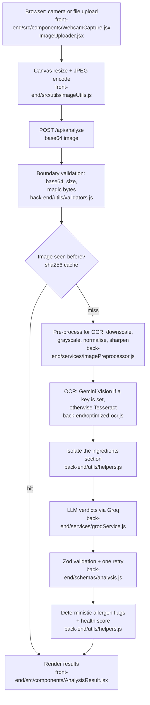

# Smart Ingredient Analyzer

Photograph a food label and get back the ingredient list, a deterministic
allergen check, and a per-ingredient health verdict from a language model.

**Live demo:** https://smart-ingredient-analyzer.vercel.app
(frontend on Vercel, API on a Render free instance)


---

## How it works



The browser captures or loads a photo, resizes it on a canvas
(`front-end/src/utils/imageUtils.js`) and posts it to the API as base64. The
route in `back-end/server.js` validates the payload at the boundary — base64
shape, byte size, and the leading magic bytes, so a renamed text file is
rejected with a 415 rather than reaching the image library.

The image is then pre-processed for whichever OCR engine will read it
(`back-end/services/imagePreprocessor.js`). Tesseract gets a downscaled,
grayscale, contrast-normalised, sharpened image; a vision model gets a
downscaled colour JPEG, because it reads colour and layout. `optimized-ocr.js`
runs Gemini Vision first when `GEMINI_API_KEY` is set and falls back to
Tesseract, which needs no key and no network.

`AnalysisHelpers.extractIngredients` isolates the ingredients section from the
raw OCR text, anchoring on an "Ingredients:" heading and stopping at the next
section heading. That text goes to Groq (`services/groqService.js`), whose reply
is validated against a Zod schema before anything downstream sees it
(`schemas/analysis.js`); an unusable reply is retried once with an explicit
repair instruction, and rows that cannot be coerced are dropped rather than
failing the whole request.

Allergen flags and the health score are **not** asked of the model. They are
computed in `utils/helpers.js` from a keyword table and a fixed scoring rule, so
the same label always produces the same flags. Results are cached twice: by
sha256 of the image bytes (a repeat photo skips OCR entirely) and by a hash of
the extracted text (a different photo of the same product skips the model call).

---

## Setup

Prerequisites: Node.js 20 or newer, and a free Groq API key from
https://console.groq.com/keys (no credit card).

### Back end

```bash
cd back-end
npm ci
cp .env.example .env      # then set GROQ_API_KEY
npm start                 # http://localhost:5000
```

`npm run dev` runs the same server with `--watch`.

Check it: `curl http://localhost:5000/health`

### Front end

```bash
cd front-end
npm ci
cp .env.example .env      # VITE_API_URL=http://localhost:5000
npm run dev               # http://localhost:5173
```

`VITE_API_URL` is inlined into the bundle at build time, so changing it requires
a rebuild. Development builds fall back to `http://localhost:5000`; production
builds refuse to run without it rather than calling an address a visitor's
browser cannot reach.

### Docker

```bash
cp back-end/.env.example back-end/.env   # set GROQ_API_KEY
docker compose up --build
```

Frontend on http://localhost:8080, API on http://localhost:5000.

### Environment variables

| Variable | Where | Required | Purpose |
| --- | --- | --- | --- |
| `GROQ_API_KEY` | back-end | yes | Ingredient analysis. Free tier, no card. |
| `GROQ_MODEL` | back-end | no | Defaults to `openai/gpt-oss-120b`. |
| `GEMINI_API_KEY` | back-end | no | Enables Gemini Vision OCR ahead of Tesseract. |
| `PORT` | back-end | no | Defaults to 5000. |
| `NODE_ENV` | back-end | no | Selects the CORS origin list and error verbosity. |
| `LOG_LEVEL` | back-end | no | `error`/`warn`/`info`/`debug`. Logs are JSON lines. |
| `VITE_API_URL` | front-end | at build time | Base URL of the API, no trailing slash. |

---

## Running the checks

```bash
cd back-end  && npm test          # 38 unit tests, no API key needed
cd front-end && npm run lint && npm run build
```

Two scripts are useful for demonstrating the system by hand:

```bash
cd back-end
npm run ocr:benchmark             # OCR with and without pre-processing, side by side
npm run smoke                     # posts the sample label to a running API
```

`npm run ocr:benchmark` on the sample label committed in this repo
(`front-end/public/ingredient.jpeg`) reports Tesseract's own confidence rising
from 57 to 67 with pre-processing enabled, and the additive codes `INS1422` and
`INS415` being read correctly instead of as `NS1422` and `S415`. That is one
image on one machine, not a benchmark — rerun it on your own photos.

CI (`.github/workflows/ci.yml`) runs the backend install and unit tests, and the
frontend install, lint and build.

---

## Tech stack

Everything here is free to run. No paid service is required.

**Back end** — Node.js + Express 4, `sharp` (image pre-processing),
`tesseract.js` (OCR, MIT, no key), `zod` (LLM response schema), `node-cache`,
`helmet`, `express-rate-limit`, `cors`, `dotenv`. Tests run on the built-in
`node:test` runner, so there is no test framework dependency.

**Front end** — React 19, Vite 6, Tailwind CSS 4, `react-webcam`.

**Model providers** — Groq for the ingredient analysis, on its free developer
tier: no credit card and no per-token charge, gated by per-minute and per-day
rate limits that vary by model. Check the limits shown for your own account at
https://console.groq.com/settings/limits, and the current model ids at
https://console.groq.com/docs/models — Groq shut down `llama-3.3-70b-versatile`
on 2026-08-16, which is why the default here is `openai/gpt-oss-120b`. Google
Gemini is optional and used only for OCR; without a Gemini key the app runs
entirely on Tesseract.

Free tiers generally permit the provider to train on submitted data. Only the
extracted ingredient **text** is sent to Groq, never the photograph. The photo
is still uploaded to this project's own backend for OCR — see
[DECISIONS.md](./DECISIONS.md).

---

## Notes and limitations

- **This is not medical or dietary advice.** The per-ingredient verdicts come
  from a language model and are not reviewed by anyone.
- **The allergen check is a keyword match**, not a guarantee. It matches a fixed
  list (`ALLERGENS` in `back-end/configuration/constants.js`) on word
  boundaries. It will miss an allergen named in a way the list does not cover,
  and it cannot see "may contain traces" warnings printed outside the
  ingredients section. Anyone with a serious allergy must read the label.
- **OCR quality sets the ceiling.** On a blurry or angled photo Tesseract
  returns noise, and the analysis is only as good as the text it was given. The
  extracted text is returned in `ingredientsText` so you can see what the model
  actually read.
- **It is slow on the free hosting tier.** Measured against the deployed API on
  2026-08-20: a cold Render instance took 22.5s to answer `/health`, and a warm
  end-to-end analysis of the sample label took 25.5s, of which the model call
  was 3.5s and the rest was Tesseract. The same OCR takes 3–5s on a laptop. The
  browser waits up to 60s before giving up.
- **The cache is in-process.** It is lost on restart and not shared between
  instances.
- **Tesseract runs per request**, spinning up a worker each time. A pooled
  worker would be the single biggest latency win and is not implemented.
- **English only.** Only `eng.traineddata` is bundled.
- **No tests for the React components.** The frontend is covered by lint and a
  build in CI, nothing more.
- The Docker setup in this repo has not been executed in the environment where
  it was written; the Node and Vite builds it wraps have been.

---

## License

MIT — see [LICENSE](./LICENSE).
